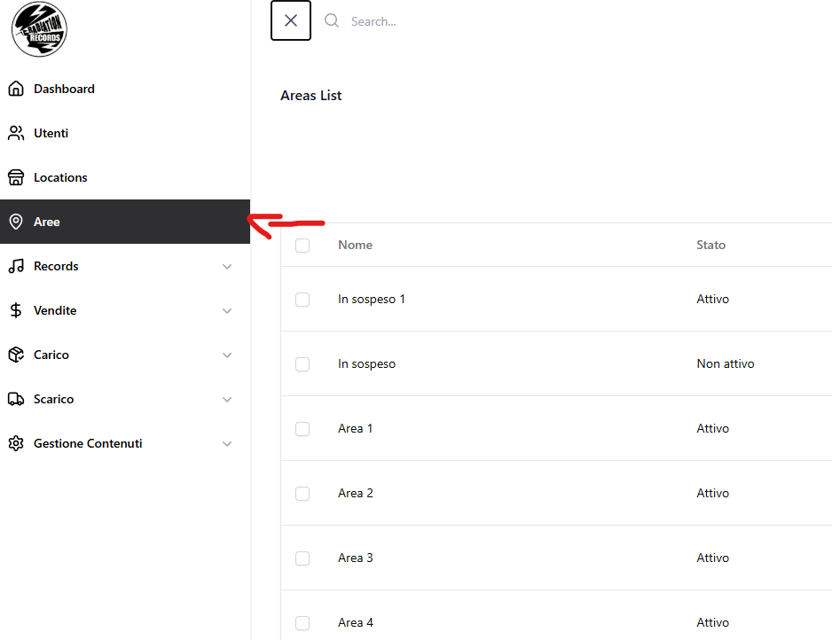
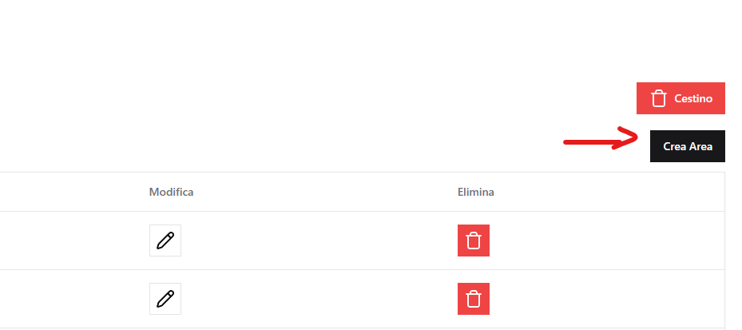
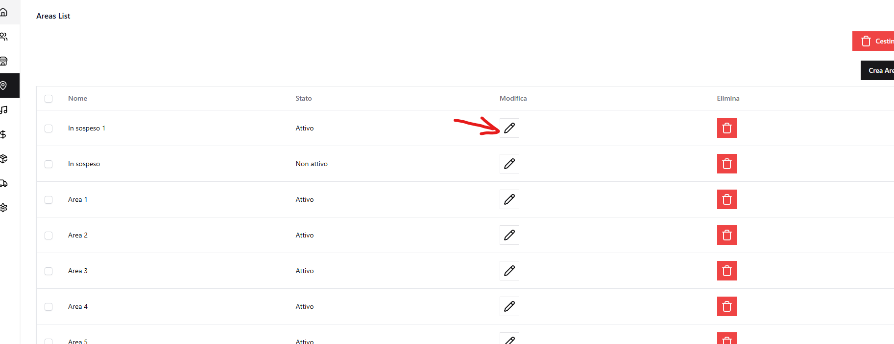

# Aree

Dal menu laterale, selezionando **Aree (`/area`)**, si accede alla pagina di gestione delle aree.

## a) Creare un'area

Per creare un'area:

- Cliccare su **"Crea area"**.

    

- Inserire il **nome** (campo obbligatorio).

### Da sapere sulla creazione area

- Per rendere attiva l'area, impostare lo **Stato** su **Attivo**.

    

- Le aree devono essere associate alle locations (dalla schermata di creazione/editing delle locations)
- Le aree sono utilizzate per la gestione dello stock dei record

---

## b) Modifica area

- Cliccare sull'icona **matita** accanto al nome dell'area.

    

- I campi sono gestiti come nella creazione.

---

## c) Eliminazione area

Funzionamento identico a utenti e locations:

- Eliminazione singola o multipla
- Gestione tramite cestino con ripristino o cancellazione definitiva

---

[← Torna all'indice](README.md)
