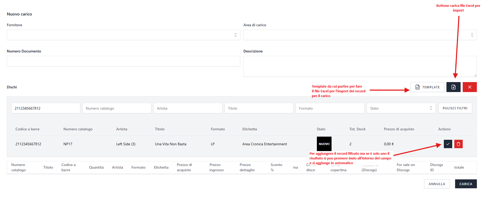
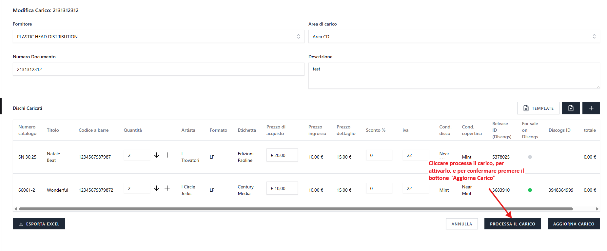
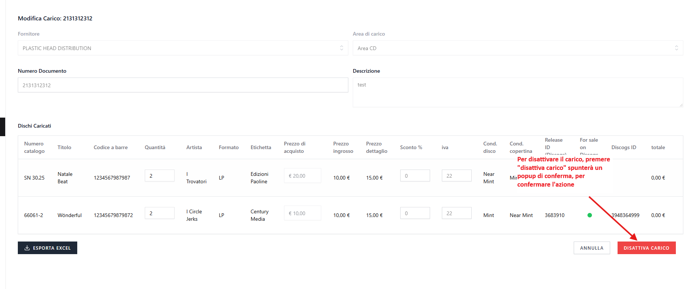
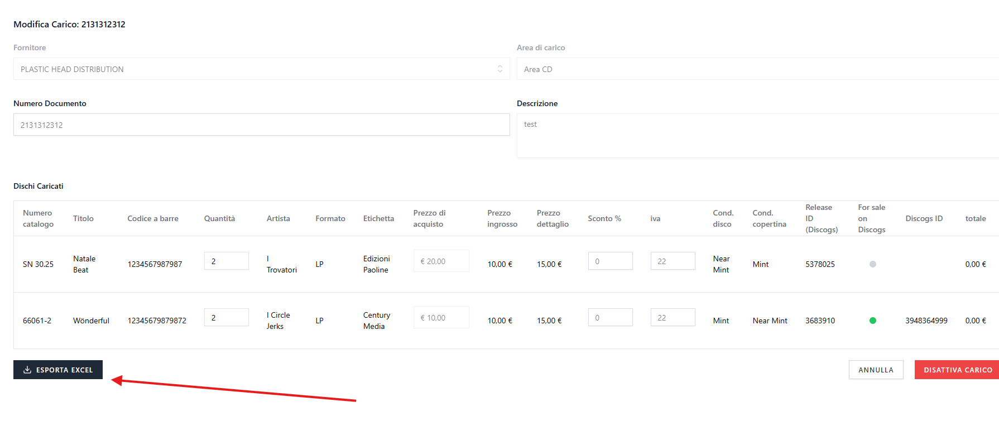

# Carichi

Dal menu laterale, selezionando **Carico (`/wholesale-in`)**, si accede alla pagina di gestione dei carichi, da cui è possibile **creare, modificare, cercare, filtrare ed eliminare i carichi**.

---

## a) Creare un carico

Per creare un carico:

1. Cliccare su **Nuovo carico**.
2. Compilare i dati richiesti.

**Campi obbligatori:**

- Fornitore
- Area di carico
- Numero documento

### Da sapere sulla creazione del carico

- Come per le vendite, c'è un filtro per aggiungere i record nei carichi e funziona allo stesso modo, quindi i record possono essere aggiunti:
    - cliccando sul pulsante **`✓`** a destra del risultato, oppure
    - se il risultato è **un solo record**, premendo **Invio** mentre il cursore è attivo su uno dei campi di filtro, senza necessità di cliccare alcun pulsante.
- È possibile importare i carichi tramite **file Excel**, partendo dal **template** scaricabile accanto al pulsante di importazione.

    

**Gestione errori durante l'importazione:**

Durante l'import Excel dei carichi, il sistema gestisce gli errori in modi diversi:

**Errori bloccanti** (l'import viene completamente rifiutato):

- File vuoto o senza dati
- Colonne obbligatorie mancanti nell'header: `cat#`, `title`, `barcode`, `q`
- Righe con colonna `q` (quantità) ≤ 0 **quando sono specificate quantità per area** nel file Excel

**Righe saltate silenziosamente** (senza avviso):

- Righe con colonna `q` (quantità) ≤ 0 **e nessuna quantità specificata per le aree**

**Comportamento speciale**:

- Se un record non viene trovato nel database (tramite barcode o cat#), viene creato come nuovo record con i dati forniti
- Se viene trovato, alcuni campi vengono aggiornati mentre altri (come i prezzi) possono essere presi dal record esistente
- Le colonne delle aree sono opzionali: se presenti, distribuiscono lo stock tra le aree specificate
- Righe duplicate nello stesso file (stesso barcode o cat#) vengono automaticamente unite sommando le quantità

**Suddivisione quantità tra aree:**

Nel carico è possibile distribuire la quantità di ogni singolo record tra diverse aree in due modi:

**Da Excel:**

- La colonna **`q`** indica la quantità totale del record nel carico (obbligatoria)
- Le **colonne delle aree** nel template (es. `magazzino`, `deposito`) sono opzionali e servono per **distribuire lo stock tra diverse aree**
- Se si specificano le colonne delle aree, lo stock viene distribuito secondo i valori indicati
- Se NON si specificano, lo stock viene caricato nell'area specificata alla voce "Area di carico".

**Esempio con distribuzione tra aree:**

- Colonna `q`: 10 (quantità totale del record nel carico)
- Colonna `magazzino`: 6 (6 pezzi vengono messi in Area Magazzino)
- Colonna `deposito`: 4 (4 pezzi vengono messi in Area Deposito)
- Risultato: il record viene caricato con quantità 10, e lo stock viene distribuito: 6 in Magazzino + 4 in Deposito

**Importante - Gestione quantità rimanenti:**

- Se la somma delle quantità delle aree è **minore** della colonna `q`, la quantità rimanente viene automaticamente assegnata all'**Area di carico** del carico.
    - Esempio: `q` = 10, `magazzino` = 3, `deposito` = 2 → 5 pezzi rimanenti vanno nell'Area di carico
- Se la somma delle quantità delle aree è **uguale** alla colonna `q`, tutto è distribuito correttamente
- Se la somma delle quantità delle aree è **maggiore** della colonna `q`, viene generato un warning ma il carico procede comunque

**Da Interfaccia UI:**

- Cliccare sulla **freccia (↓)** vicino all'input quantità del record
- Si apre un **dropdown** che mostra le aree disponibili
- Per ogni area è possibile:
    - Selezionare l'area dal menu a tendina
    - Inserire la quantità da caricare in quell'area specifica
    - Aggiungere ulteriori aree cliccando il pulsante **+**
    - Rimuovere aree cliccando il pulsante **×**
- La quantità totale viene calcolata automaticamente sommando le quantità di tutte le aree

    

**Note importanti:**

- La colonna `q` rappresenta la quantità totale del carico
- Le colonne opzionali includono: `artist`, `fmt`, `label`, `price`, `whole_price`, `retail_price`, `discount`, `iva`, `condition_disk`, `condition_cover`, `for_sale_on_discogs`, `release_id (discogs)`, `discogs_id`
- Per marcare un record per la pubblicazione su Discogs, impostare `for_sale_on_discogs = 1` nel file Excel
- Colonna **`release_id (discogs)`**: inserire qui il Release ID del disco. Serve a creare l'annuncio e permette di pubblicare subito un record nuovo direttamente dall'import
- **Lasciare vuota la colonna `discogs_id`**: per convenzione rappresenta il Listing ID dell'annuncio, ma il valore inserito **non viene salvato** (viene ignorato). Il Listing ID è assegnato automaticamente dall'app solo quando l'annuncio viene creato e Discogs lo conferma. Vedi [Discogs: Release ID e Listing ID](DISCOGS_IDS.md)

- Il carico appena inserito, di default è disattivo, una volta inserito potrà essere attivato.

---

## b) Modifica carico

- Cliccare sull'icona **matita** nel carico da modificare nella lista dei carichi
- I carichi nell'edit possono essere **attivati o disattivati**:

    - Quando un carico viene **attivato**, gli stock dei record vengono **incrementati**.

        

    - Quando un carico viene **disattivato**, l'incremento viene **rimosso**, se è stato attivato in precedenza.

        

### Pubblicazione automatica su Discogs tramite import

Durante l'importazione di un carico da file Excel è possibile marcare i record per la pubblicazione automatica su Discogs.

> Prima di procedere, leggere [Discogs: Release ID e Listing ID](DISCOGS_IDS.md) per capire la differenza tra i due identificativi. In breve: il **Release ID** identifica il disco e serve a creare l'annuncio; il **Listing ID** (`discogs_id`) è l'ID dell'annuncio, assegnato da Discogs, e non va mai inserito a mano.

**Configurazione nel file Excel:**

- Colonna **`for_sale_on_discogs`**: impostare a `1` per marcare il record da pubblicare
- Colonna **`release_id (discogs)`**: inserire il Release ID del disco. È ciò che permette di pubblicare **subito** un record nuovo dall'import
- Colonna **`discogs_id`**: **lasciare vuota**. Per convenzione rappresenta il Listing ID, ma il valore **non viene importato**: l'app lo ignora e scrive `discogs_id` solo dalla conferma di Discogs alla creazione dell'annuncio. (In passato il valore veniva salvato: inserendovi un Release ID il record risultava "pubblicato" ma il link Discogs dava 404. Ora non accade più.)

**Processo di pubblicazione automatica:**

1. Importare il file Excel con `for_sale_on_discogs = 1` e il `release_id (discogs)` per i record da pubblicare (colonna `discogs_id` vuota)
2. Verificare e completare l'importazione
3. **Attivare il carico** (status = 1)
4. I record vengono automaticamente pubblicati su Discogs se hanno un **Release ID** e stock disponibile

**Limitazioni e note importanti:**

- Se il record **non ha un Release ID** (né in colonna `release_id (discogs)` né già salvato), non verrà pubblicato: aggiungerlo nel file oppure aprire il record in modifica e usare "Cerca su Discogs"
- **Disattivando e riattivando un carico**, i record NON vengono automaticamente ripubblicati su Discogs
- Per ripubblicare record dopo una disattivazione, è necessario utilizzare la modifica manuale del record
- I record già presenti nel sistema con un `discogs_id` esistente (annuncio già attivo) non vengono ri-pubblicati tramite import (protezione per evitare annunci duplicati)

**Esempio pratico:**

File Excel con le seguenti colonne compilate (`release_id (discogs)` con il Release ID, colonna `discogs_id` lasciata vuota):

```
cat#  | barcode      | title       | for_sale_on_discogs | release_id (discogs) | discogs_id
ABC123| 123456789012 | Album Name  | 1                   | 12345678             |
```

All'attivazione del carico, il record (anche se nuovo) verrà pubblicato su Discogs grazie al Release ID indicato, purché abbia stock disponibile.

---

## c) Eliminazione Carico

Il funzionamento è analogo a quello degli utenti e delle altre sezioni:

- Eliminazione singola o multipla
- I carichi non hanno cestino quindi non hanno possibilità di ripristino o eliminazione definitiva
- Cancellando un carico attivo, lo **stock** dei record corrispondenti verrà **decrementato** automaticamente.

---

## d) Esportazione Carico

- È possibile esportare l'excel del singolo carico.

    

---

[← Torna all'indice](README.md)
