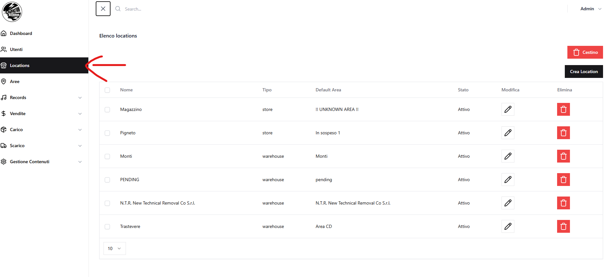
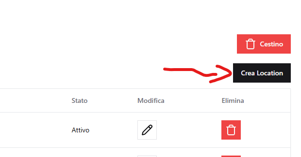
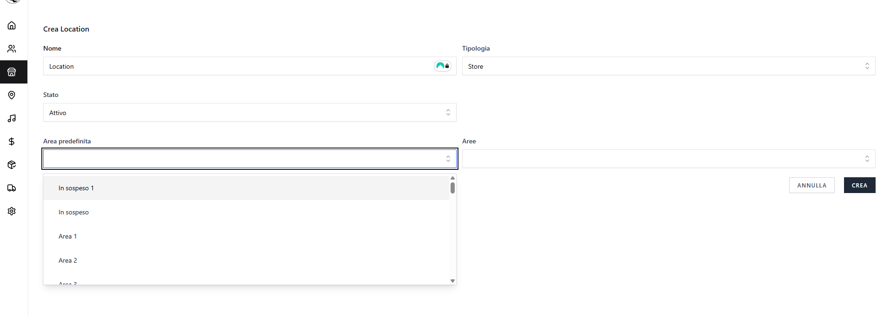
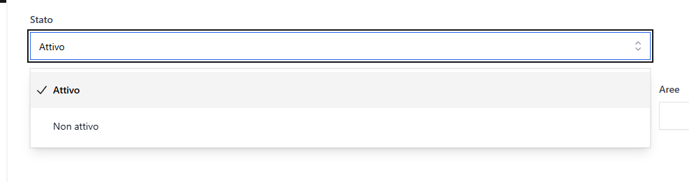
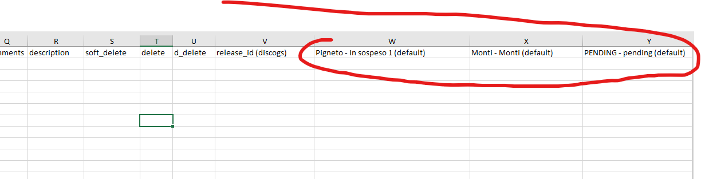
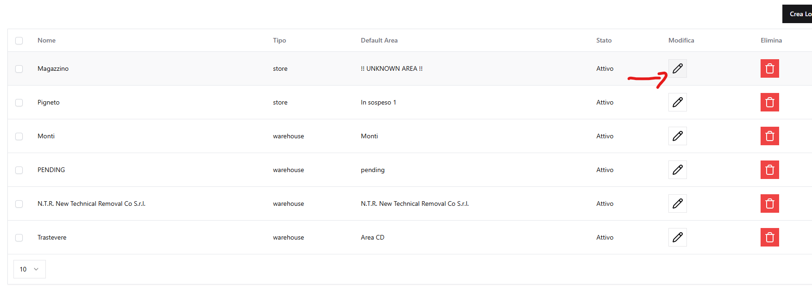

# Locations

Dal menu laterale, selezionando **Locations (`/location`)**, si accede alla pagina di gestione delle locations, dove è possibile **crearle, modificarle, cercarle ed eliminarle**.

## a) Creare una location

Per creare una location:

1. Cliccare su **"Crea Location"**.

    

2. Compilare i dati richiesti.

**Campi obbligatori:**

- Nome
- Tipologia

    

### Tipologie di Location

Esistono due tipologie di location, ciascuna con funzionalità specifiche:

- **Warehouse (Magazzino)**: Location di stoccaggio principale

    - Utilizzate per la gestione dell'inventario principale
    - Sono quelle usate come destinatarie dei carichi e come sorgenti degli scarichi
    - Gli stock non sono disponibili per le vendite al dettaglio

- **Retail (Negozio)**: Location di vendita al dettaglio
    - Utilizzate per la gestione dello stock in punti vendita fisici
    - Non possono essere selezionate per i carichi
    - Gli stock non sono disponibili per gli scarichi
    - Gli stock sono disponibili solo per le vendite al dettaglio

### Area predefinita di una Location

Ogni location ha un'**area predefinita** che deve essere configurata nelle impostazioni della location.

**Best practice importante:** L'area predefinita dovrebbe essere chiamata con **lo stesso nome della location** per evitare confusione, poiché in alcuni componenti si usano le aree e in altri le location (per seguire le necessità operative).

**Dove viene utilizzata l'area predefinita:**

- Nei **template di import/export Excel** dei record come colonna precompilata
- Quando si seleziona una location in operazioni di carico/scarico, la sua area predefinita viene proposta

### Location predefinita per gli Scarichi (solo Warehouse)

Una sola location di tipo **Warehouse** può essere impostata come **location predefinita per gli scarichi** a livello di tutta l'applicazione.

**Effetto:** Quando si crea un nuovo scarico (WholesaleOut), questa location viene **preselezionata automaticamente**, e di conseguenza anche la sua area predefinita viene preselezionata.

### Area predefinite nelle Vendite

Nelle **vendite** (Sale) sono mostrate **solamente le aree predefinite** delle location di tipo **Retail/Store** (non tutte le aree, solo quelle predefinite).

### Da sapere sulla creazione location

- Per rendere attiva la location, impostare il campo **Stato** su **Attivo**.

    

- Per le location di tipo **Warehouse**, è possibile impostare la checkbox **"Location Predefinita"** per renderla la location di default per tutti gli scarichi.

- L'**area predefinita** selezionata sarà disponibile nei template di import/export Excel dei record.

    

---

## b) Modifica location

- Cliccare sull'icona **matita** accanto al nome della location.

    

- I campi sono gestiti come nella creazione.

---

## c) Eliminazione location

Il funzionamento è analogo a quello degli utenti:

- Eliminazione singola o multipla
- Primo passaggio nel **Cestino**
- Possibilità di ripristino o eliminazione definitiva

---

[← Torna all'indice](README.md)
