# Records

Dal menu laterale, selezionando **Records (`/record`)**, si accede alla pagina di gestione dei record, da cui è possibile **creare, modificare, cercare, importare, esportare ed eliminare i record**.

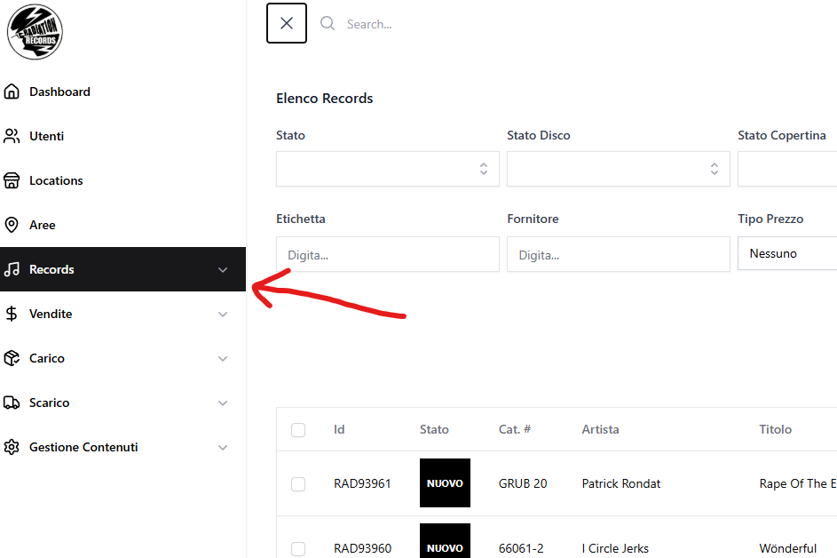

---

## a) Creare un record

Per creare un record:

- Cliccare su **"Crea record"**.

    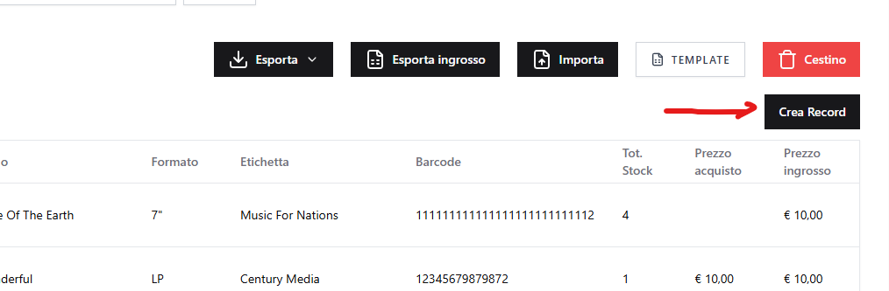

**Campi obbligatori:**

- Codice a barre
- Numero catalogo
- Formato
- Titolo
- Prezzo al dettaglio
- Prezzo all'ingrosso
- Stato (Nuovo / Usato)

### Da sapere sulla creazione record

- Inserendo ID / link release e cliccando su "Cerca su Discogs" (in alto a destra), i campi del record vengono autocompilati con i dati presenti su Discogs, se disponibili. Inserendo codice a barre o numero di catalogo verrà mostrato un popup di selezione per scegliere quale record utilizzare per l'autocompilazione.

    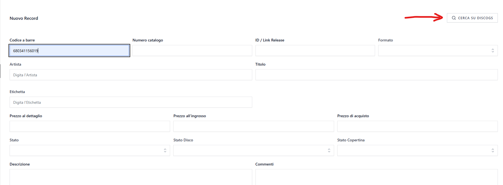
    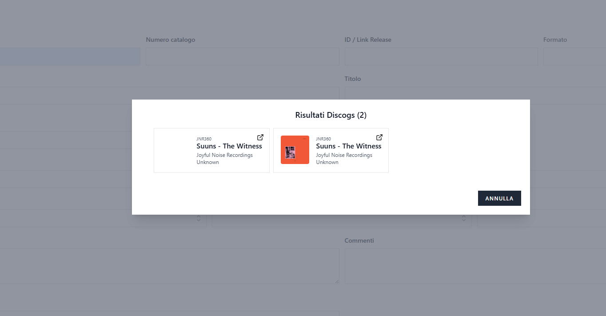
    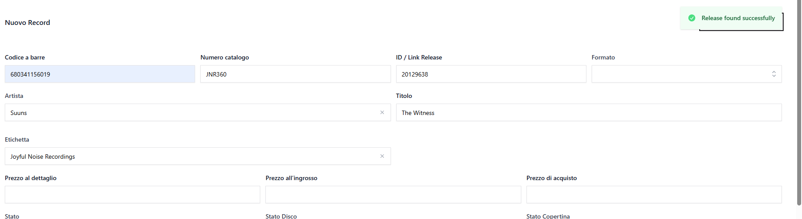

- È possibile gestire lo stock del record in più aree.

    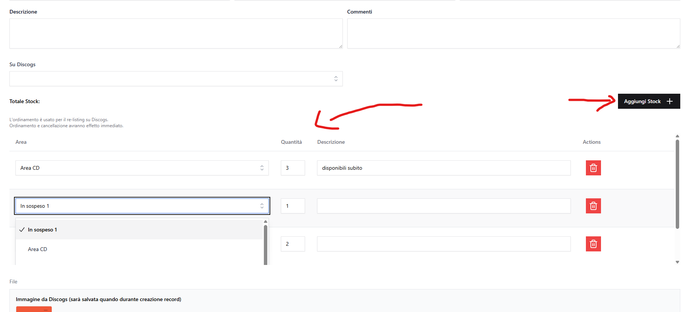

### Ordine delle aree (order_column)

Quando un record ha stock in più aree, l'**ordine delle aree** determina priorità specifiche per le operazioni Discogs:

- **Pubblicazione su Discogs**: Viene utilizzata la prima area con stock disponibile (seguendo l'ordine dall'alto verso il basso)
- **Re-listing automatico su Discogs**: Quando lo stock di un'area pubblicata si esaurisce ma rimane stock in altre aree, l'annuncio viene ripubblicato dalla prossima area disponibile nell'ordine

**Come modificare l'ordine:**
L'ordine delle aree si gestisce tramite **drag & drop** nella sezione stock del record durante la modifica. Trascinare le righe verso l'alto o il basso per cambiare la priorità.

**Nota importante:** L'ordine delle aree è utilizzato **esclusivamente per le operazioni Discogs**. Per vendite e scarichi, l'area viene selezionata esplicitamente dall'utente.

**Esempio pratico:**
Record con stock in 3 aree:

1. Area Magazzino (5 pezzi) ← Usata per Discogs
2. Area Negozio (3 pezzi)
3. Area Deposito (10 pezzi)

Se il Magazzino si esaurisce, l'annuncio su Discogs viene automaticamente aggiornato con "Area Negozio".

### Pubblicazione su Discogs

È possibile pubblicare i record sul marketplace Discogs per la vendita online.

> Discogs usa due identificativi distinti: il **Release ID** (il disco, lo fornisci tu) e il **Listing ID** / `discogs_id` (l'annuncio, lo assegna Discogs). Qui inserisci solo il Release ID. Per il dettaglio completo vedi [Discogs: Release ID e Listing ID](DISCOGS_IDS.md).

**Requisiti per pubblicare un record su Discogs:**

- Il record deve avere almeno uno stock
- È necessario ottenere il **Release ID** da Discogs tramite il pulsante "Trova release id"
- Impostare il campo "Su Discogs" su "In vendita"

**Come pubblicare un record:**

1. Modificare il record
2. Cliccare su **"Cerca su Discogs"** per cercare il record su Discogs e ottenere il Release ID
3. Verificare che ci sia almeno uno stock disponibile in una location
4. Impostare il campo **"Su Discogs"** su **"In vendita"**
5. Salvare il record

    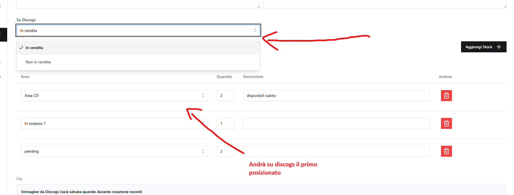

**Gestione automatica dell'annuncio:**

Il sistema gestisce automaticamente gli annunci su Discogs:

- **Rimozione automatica**: Quando lo stock raggiunge zero (tramite vendite, scarichi o eliminazione del record), l'annuncio viene automaticamente rimosso da Discogs
- **Aggiornamento location**: Se lo stock di un'area si esaurisce ma rimane stock in altre aree, l'annuncio viene aggiornato automaticamente con la nuova location (secondo l'ordine delle aree)
- **Aggiornamento dati**: Modifiche a prezzo, condizioni del disco/copertina o descrizione vengono sincronizzate automaticamente su Discogs

**Note importanti:**

- L'area utilizzata per la pubblicazione è la prima nell'ordine con stock disponibile
- Non è possibile modificare il Release ID di record già pubblicati su Discogs
- Il **Listing ID** (`discogs_id`) mostrato in "Listed on Discogs: ID …" viene assegnato automaticamente dopo la pubblicazione: non va inserito né modificato a mano
- Per informazioni sulla sincronizzazione automatica degli ordini da Discogs, consultare [Discogs - Sincronizzazione Ordini](DISCOGS.md)

---

## b) Modifica record

- Cliccare sull'icona **matita** accanto al record.

    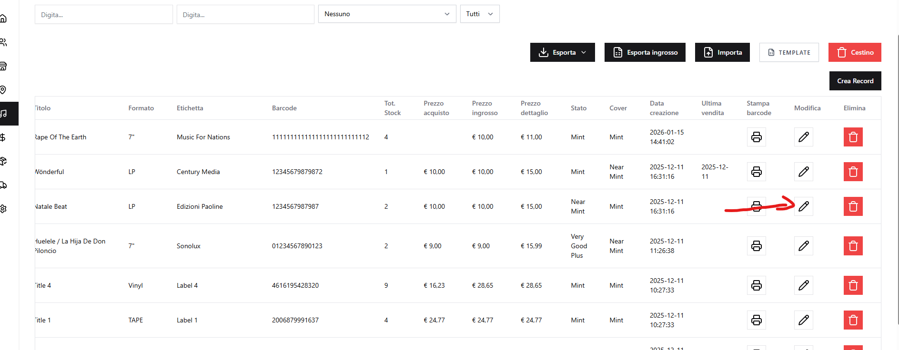

- I campi sono gestiti come nella creazione.

---

## c) Eliminazione record

Il funzionamento è analogo a quello degli utenti e delle altre sezioni:

- Eliminazione singola o multipla
- Primo passaggio nel **Cestino**
- Possibilità di ripristino o eliminazione definitiva

---

## d) Esportazione record

Tipologie di export disponibili (vengono esportati i record in base ai filtri selezionati nella lista dei record):

- Export di default (dal bottone "Esporta" nella tendina cliccare export default)

    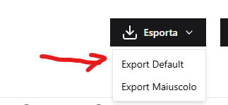
    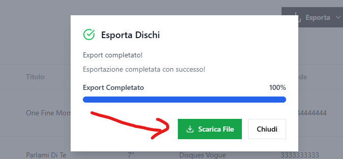
    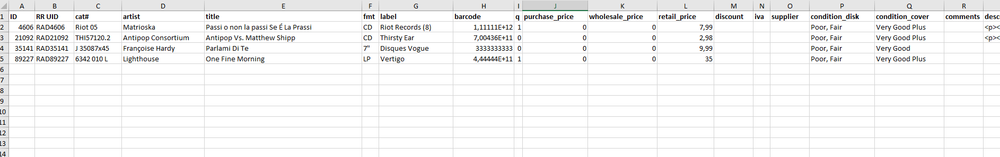

- Export con caratteri maiuscoli (non utilizzabile per import) (dal bottone "Esporta" nella tendina cliccare export maiuscolo)

    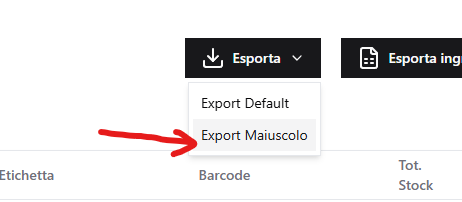
    
    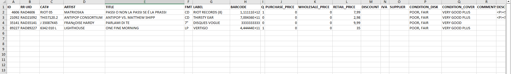

- Export ingrosso - Record con prezzo ingrosso inserito (prezzo e disponibilità) (dal bottone "Esporta ingrosso")

    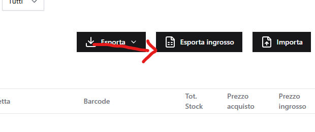
    
    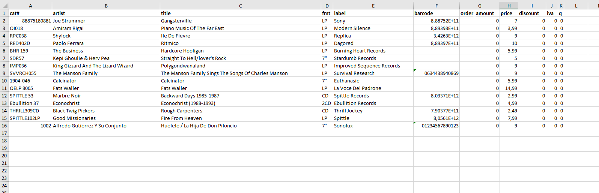

---

## e) Importazione record

- È possibile **importare i record** per crearli o aggiornarli, cliccando sul pulsante **"Importa"**.  
  Il **template Excel** per l'importazione può essere scaricato tramite il pulsante **"Template"**, accanto a **"Importa"** nella lista dei record. Nel file di importazione i valori da inserire in condition_disk e condition_cover sono i seguenti (ogni valore è diviso da -): (Mint - Near Mint - Very Good Plus - Very Good - Good, Good Plus - Poor, Fair - Generic)

    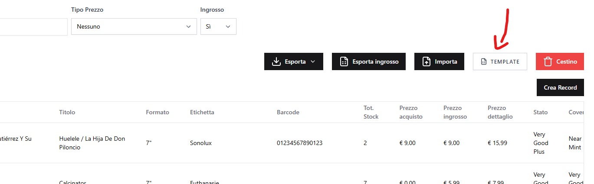

- Cliccando su **"Importa"** si accede alla lista degli import (`records-import`), dove:

    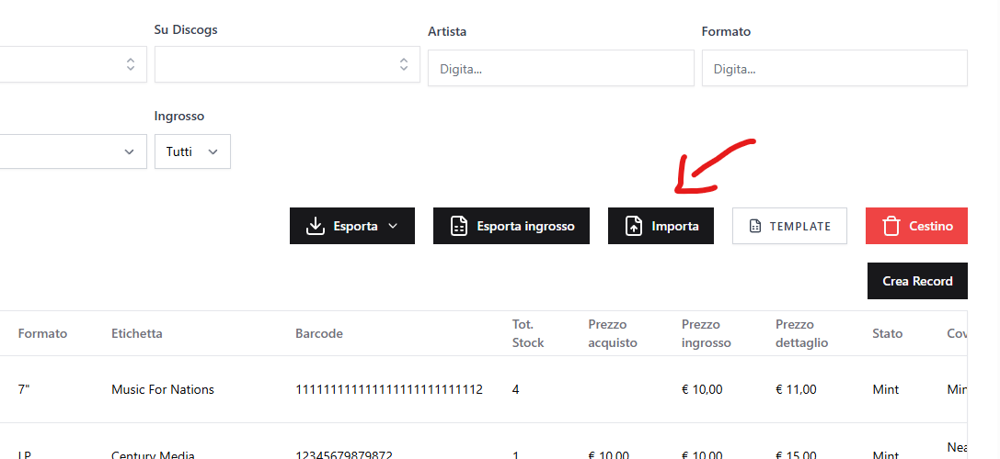
    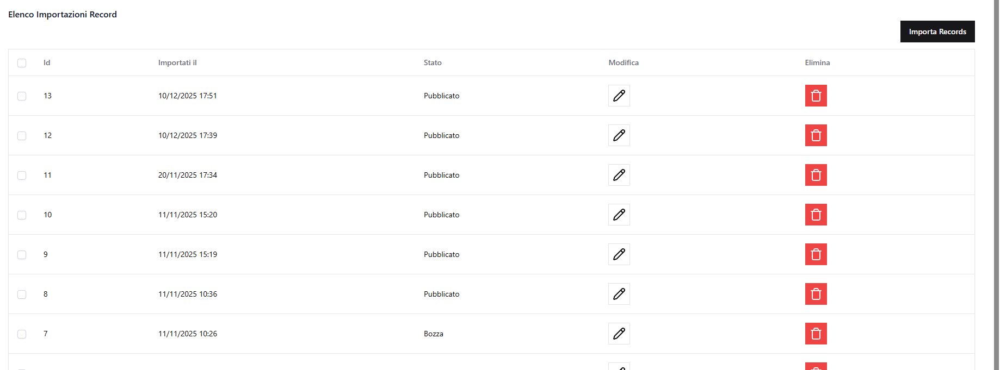

    - per gli import **pubblicati** è visibile la data di esecuzione;

        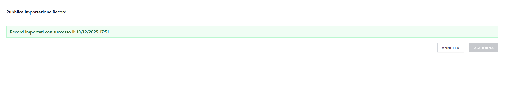

    - per gli import **non pubblicati** è possibile modificare i record importati dal file Excel prima di approvarli.

        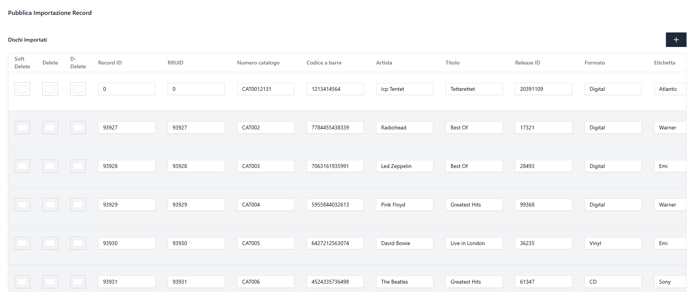

- Per avviare un nuovo import, cliccare su **"Importa records"** nella lista degli import:

- Nell'import è possibile gestire le quantità stock per area in due modi:

    **Da file Excel:**

    - Utilizzare le **colonne dinamiche delle aree** nel template (es. `magazzino`, `deposito`)
    - **0** → azzera la quantità in quell'area
    - **n** → imposta la quantità a n (dove n è un qualsiasi numero intero maggiore di 0) in quell'area
    - **[cella vuota]** → non modifica la quantità in quell'area

    **Da interfaccia UI (dopo l'upload del file):**

    - Dopo aver caricato il file Excel, nella **tabella di anteprima** apparirà una colonna "Stocks"
    - Cliccare sul pulsante **"Stock presenti"** (in verde se ci sono stock) per aprire il dropdown
    - Nel dropdown è possibile **visualizzare e modificare** le quantità per ciascuna area
    - Le modifiche vengono applicate quando si salva l'import

    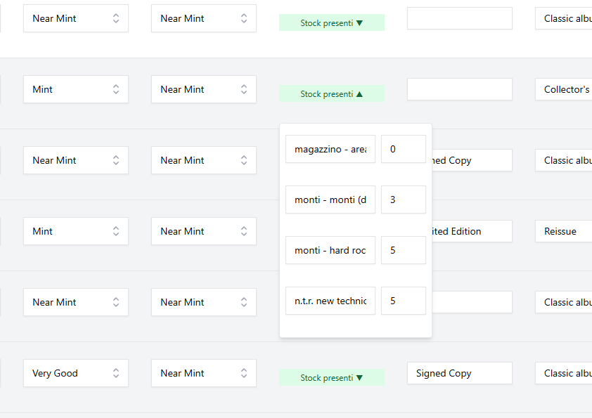

    **Nota importante**: La gestione stock nell'import massivo è **limitata alle aree già presenti nel file Excel** (quindi le aree di default di ciascuna location). Per aggiungere o rimuovere Stock, o per una gestione più completa dello stock, è necessario utilizzare l'**editor del singolo record** (dove è disponibile il componente Stock List completo con possibilità di aggiungere/rimuovere Stock).

    - è possibile caricare un **file Excel** (basato sul template fornito);

        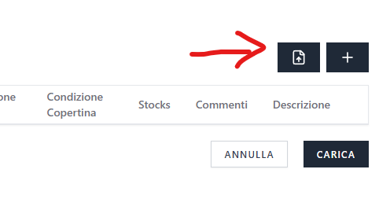
        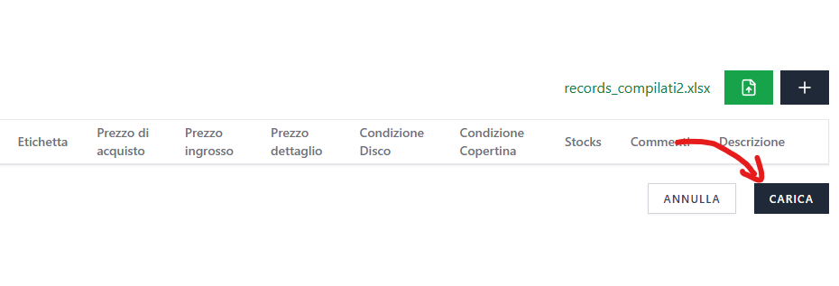
        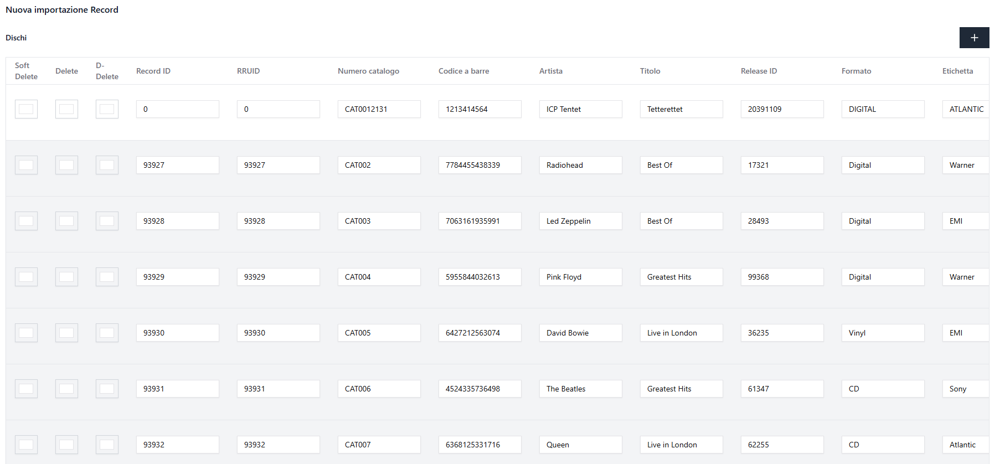

    - in alternativa, è possibile aggiungere manualmente i record tramite il pulsante **"+"**, compilando tutti i campi richiesti.

        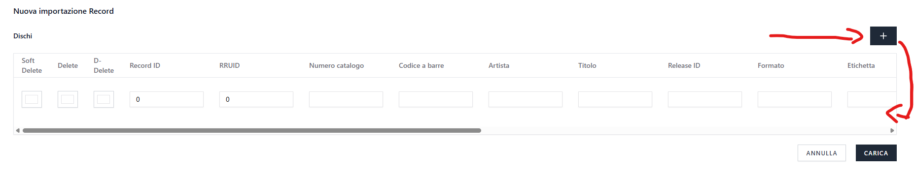

- Se i record sono già presenti nel sistema, verranno **aggiornati**; in caso contrario, verranno **creati**.

- Durante l'import (da Excel o manuale), per ogni record sono disponibili tre opzioni (nell'excel si seleziona con una X):

    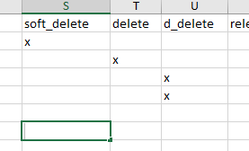

    - **Delete** → elimina definitivamente il record (se già presente);
    - **Soft delete** → sposta il record nel **cestino**;
    - **D-Delete** → rimuove il record da **Discogs**.

    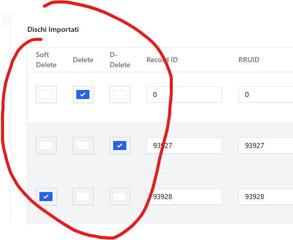

- Una volta **salvato** l'import, è necessario **pubblicarlo** affinché l'importazione diventi effettiva.  
  Senza la pubblicazione, **nessun nuovo record o modifica** verrà applicato al sistema.

    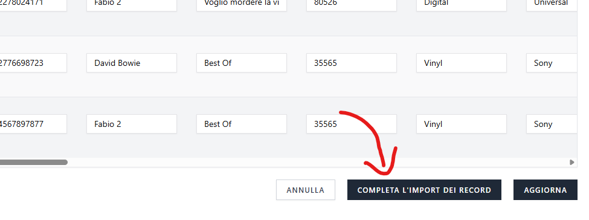
    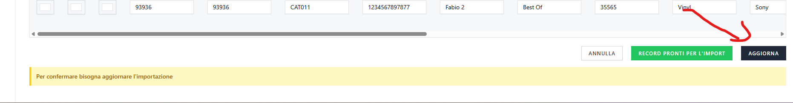

### Gestione errori durante l'importazione record

Durante l'import Excel dei record, il sistema gestisce gli errori in modi diversi:

**Errori bloccanti** (l'import viene completamente rifiutato):

- File vuoto o senza dati
- Colonne obbligatorie mancanti nell'header: `ID`, `cat#`, `artist`, `title`, `fmt`, `label`, `barcode`, `q`

**Comportamento speciale**:

- Se un record non viene trovato nel database (tramite ID, barcode o cat#), viene creato come nuovo record
- Se viene trovato, i suoi dati vengono aggiornati con i valori dall'Excel
- Le colonne delle aree (stock per area) sono opzionali e vengono processate se presenti nel template

**Note importanti:**

- L'import dei record processa **tutte** le righe valide del file
- I record possono essere contrassegnati per eliminazione con le colonne `delete`, `soft_delete` o `d_delete`
- La colonna `ID` è opzionale: se presente identifica il record da aggiornare, altrimenti si usa barcode o cat#

---

[← Torna all'indice](README.md)
