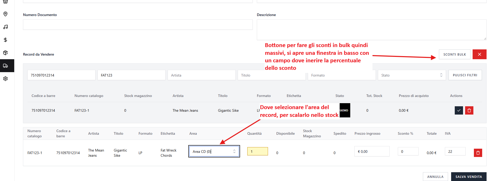
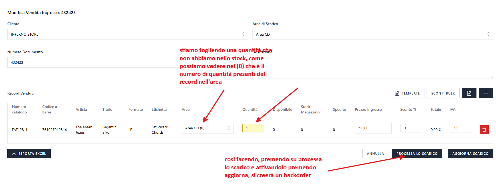
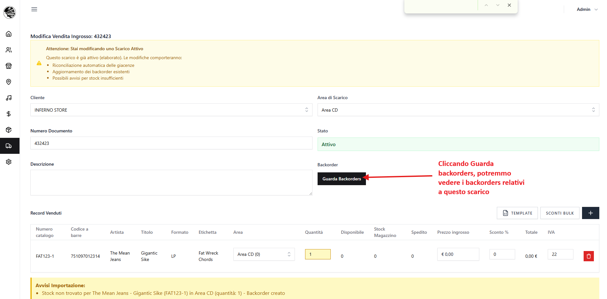
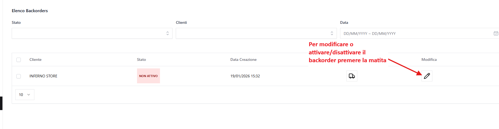
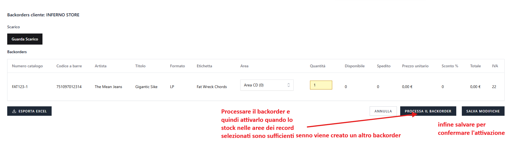
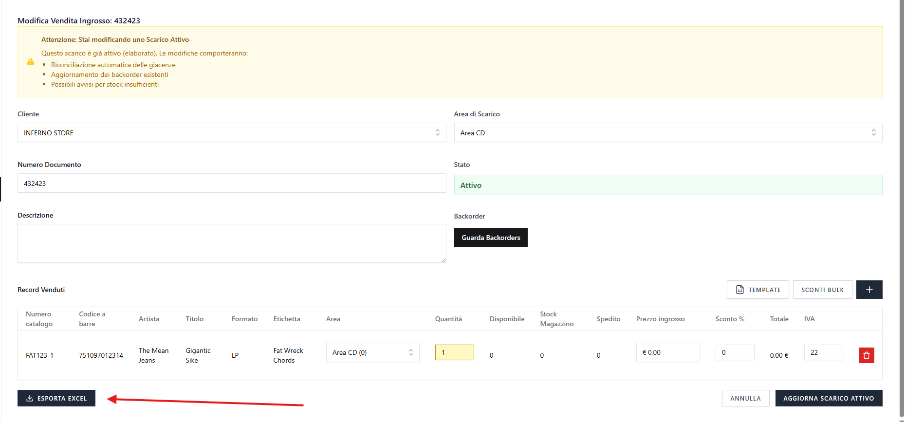

# Scarico e Backorder

Per creare uno scarico e eventuale backorder:

1. Cliccare su **Nuova Vendita**.
2. Compilare i dati richiesti.

**Campi obbligatori:**

- Cliente
- Area di scarico
- Numero documento
- Record da Vendere

## Aree disponibili negli scarichi

Negli scarichi (WholesaleOut) sono mostrate **solamente le aree predefinite delle location di tipo Warehouse**.

Questo assicura che gli scarichi avvengano solo dai magazzini e non dai punti vendita al dettaglio.

## Selezione dell'area per ogni record

La selezione dell'area da cui scaricare le quantità dei singoli record può avvenire in due modi:

**Da Excel:**

- Inserire una **"x"** nella colonna corrispondente all'area da cui prelevare lo stock
- Esempio: per scaricare dall'Area Magazzino, inserire "x" nella colonna `magazzino`
- **Importante**: La quantità del record viene prelevata da **una sola area** (non c'è suddivisione come nei carichi)

**Da Interfaccia UI:**

- Selezionare l'area desiderata dal menu a tendina "Area" per ogni singolo record
- Solo le aree warehouse disponibili saranno mostrate nel menu

## Logica di scalamento stock

Quando uno scarico viene processato, il sistema applica questa logica:

- **Se è specificata un'area a livello di record**: la quantità viene scaricata da quell'area specifica
- **Se non è specificata**: la quantità viene scaricata dall'area impostata a livello di scarico (campo "Area di scarico")
- **Nessun prelievo automatico da altre aree**: Se la quantità non è disponibile in un solo magazzino, deve essere prima spostata manualmente modificando lo stock del singolo record (diminuendo lo stock di un'area e aumentandolo in un'altra)

## Da sapere sulla creazione dello scarico e dell'eventuale backorder

- Come per le vendite e carichi, c'è un filtro per aggiungere i record negli scarichi e funziona allo stesso modo, quindi i record possono essere aggiunti:
    - cliccando sul pulsante **`✓`** a destra del risultato, oppure
    - se il risultato è **un solo record**, premendo **Invio** mentre il cursore è attivo su uno dei campi di filtro, senza necessità di cliccare alcun pulsante.
- Bisogna inserire l'area del record, per poterlo scalare nello scarico una volta attivato
- Lo scarico appena inserito, di default è disattivo, una volta inserito potrà essere attivato.

    

---

## b) Modifica scarico

- Cliccare sull'icona **matita** nello scarico da modificare nella lista degli scarichi
- Gli scarichi possono essere **attivati o disattivati** nello stesso modo del carico:
    - Quando uno scarico viene **attivato**, gli stock dei record dell'area scelta vengono **decrementati**.
    - Quando uno scarico viene **disattivato**, gli stock vegono **incrementati** delle quantità precedentemente rimosse, se è stato attivato in precedenza.
- Si possono aggiungere in Bulk gli sconti nei record degli scarichi.
- Se uno scarico viene **attivato** e nei record non ci sono abbastanza stock, viene creato un **Backorder** contenente la quantità mancante.

    
    
    

    Il Backorder deve essere **attivato manualmente** quando lo stock è sufficiente.  
     In caso di attivazione di un Backorder in un momento in cui non ci siamo quantità di Stock sufficienti a coprire quelle richieste, verrà generato un **ulteriore Backorder** per compensare la mancanza, oltre a quello già esistente.

    

- Si puo andare nel backorder dello scarico cliccando nella lista degli scarichi la freccetta sopra alla colonna "Backorder" o nella pagina modifica dello scarico, cliccando il bottone "Guarda Backorders" oppure si possono vedere tutti cliccando nel sotto menu di Scarico nel menu a sinistra cliccando "Backorder"

### Modifica di uno scarico attivo - Logica di Riconciliazione

**⚠️ Attenzione**: Quando si modifica uno scarico **già attivo** (stato = 1), il sistema esegue automaticamente una **riconciliazione delle giacenze** per garantire la correttezza degli stock.

**Come funziona la riconciliazione:**

1. **Per ogni record modificato o eliminato** (uno o più):
    - **Prima fase - Ripristino**: Il sistema ripristina le quantità precedentemente scalate del record, riportando lo stock allo stato prima dello scarico
    - **Seconda fase - Riallocazione**: Applica le nuove quantità del record con i valori aggiornati (solo per record modificati, non eliminati)
2. **Gestione backorder attivi**: Tutti i backorder precedentemente attivati vengono **automaticamente cancellati** e le loro quantità ripristinate, poiché non sono più validi con le nuove modifiche.
   Se necessario, viene creato un nuovo backorder con le quantità aggiornate

**Nota importante**: Durante la modifica di uno scarico attivo, potrebbero apparire avvisi se gli stock disponibili sono insufficienti per le nuove quantità richieste.

### Importazione scarichi da Excel

È possibile importare gli scarichi tramite file Excel. Per scaricare il template:

- Andare nella lista degli scarichi
- Cliccare su "Template" accanto al pulsante "Importa"

**Gestione errori durante l'importazione:**

Durante l'import Excel, il sistema gestisce gli errori in modi diversi:

**Errori bloccanti** (l'import viene completamente rifiutato):

- File vuoto o senza dati
- Colonne obbligatorie mancanti nell'header (almeno uno tra `barcode` o `cat#`, e la colonna `order_amount`)

**Righe saltate silenziosamente** (senza avviso):

- Righe con `order_amount` (quantità) ≤ 0
- Record non trovati nel sistema (vengono mostrati in una sezione separata "Record non trovati" per facilitare la ricerca e l'eventuale creazione)

**Avvisi** (l'import procede, ma vengono mostrati messaggi):

- Righe con barcode E cat# entrambi mancanti
- Stock non disponibile nell'area specificata o di default (verrà creato automaticamente un backorder)

**Note importanti:**

- I record non trovati nel sistema vengono mostrati in una sezione dedicata con i dettagli, permettendo di cercarli manualmente o crearli prima di riprovare l'import
- Le righe saltate silenziosamente non compaiono nei risultati dell'import
- Se viene marcata un'area specifica nel file Excel (con una "x" nella colonna dell'area), lo stock verrà scalato da quell'area; altrimenti verrà usata l'area di default dello scarico

---

## c) Eliminazione Scarico e Backorder

Il funzionamento è analogo a quello degli utenti e delle altre sezioni:

- Eliminazione singola o multipla
- Gli scarichi non hanno cestino quindi non hanno possibilità di ripristino o eliminazione definitiva
- Cancellando uno scarico attivo, lo **stock** dei record corrispondenti verrà **incrementato** automaticamente e verranno cancellati di conseguenza anche eventuali backorder associati.

---

## d) Esportazione Scarico e Backorder

- È possibile esportare l'excel del singolo scarico e backorder.

    

---

## e) Impatto su Discogs

Gli scarichi possono influenzare automaticamente gli annunci pubblicati su Discogs:

**Quando si effettua uno scarico di un record pubblicato su Discogs:**

- **Stock esaurito**: Se lo scarico porta lo stock del record a zero, il listing viene **automaticamente rimosso** da Discogs
- **Stock residuo in altre aree**: Se dopo lo scarico rimane stock in altre aree, il listing viene **automaticamente aggiornato** con la nuova location, seguendo l'ordine delle aree

**Nota**: La gestione automatica degli annunci avviene sia durante l'attivazione/disattivazione degli scarichi, sia durante la modifica di scarichi attivi con riconciliazione dello stock.

---

[← Torna all'indice](README.md)
