# Utenti

**(Gestione consentita solo agli Amministratori)**

Dal menu laterale, selezionando **Utenti (`/user`)**, si accede alla pagina di gestione degli utenti, dalla quale è possibile **creare, modificare, cercare, filtrare per ruolo ed eliminare gli utenti**.

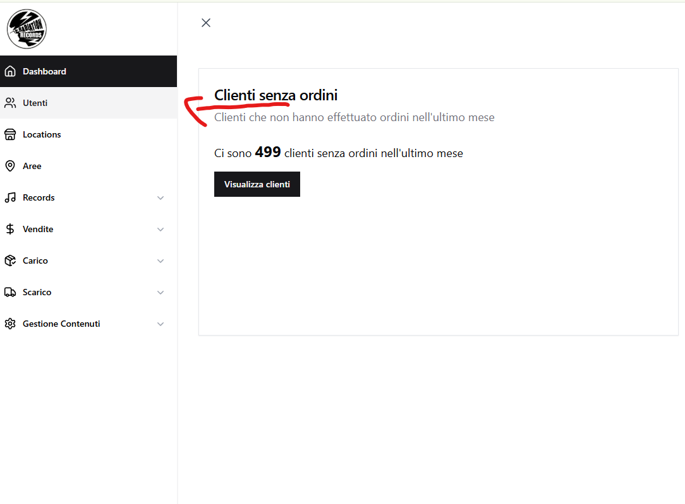

## a) Creare un utente

Per creare un nuovo utente:

1. Cliccare sul pulsante **"Crea utente"** in alto a destra.

    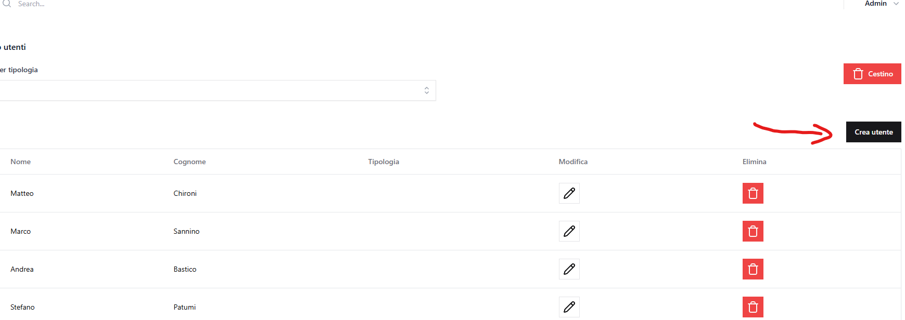

2. Compilare il form con i dati richiesti.

    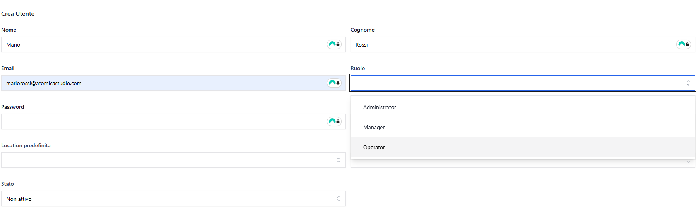

**Campi obbligatori:**

- Nome
- Email
- Ruolo
- Password

### Da sapere sulla creazione utente

- Per rendere attivo un utente è necessario impostare il campo **Stato** su **Attivo**.

    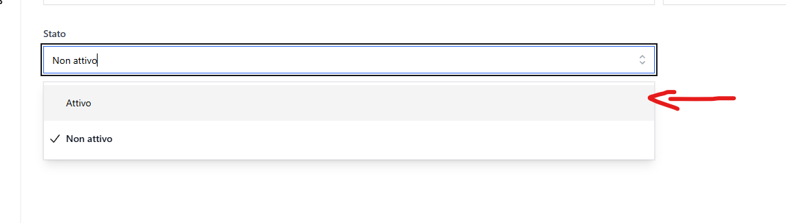

- È possibile associare una o più **locations**, così da consentire agli utenti di ruolo Manager e Operator di operare su di esse.
- Tra le **locations** assegnate all'utente, è possibile impostare una **location predefinita**, che verrà selezionata automaticamente nella sezione **Vendite** durante la creazione o modifica di una vendita.

    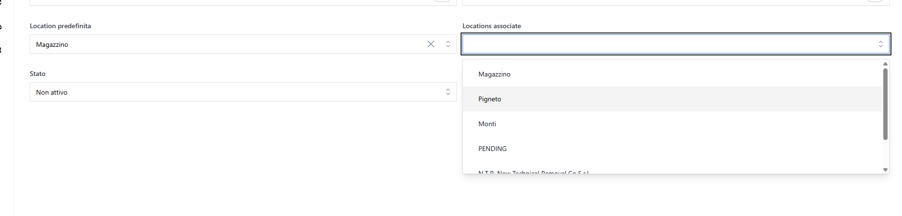

### Ruoli disponibili

**Amministratore (Admin)**

- Accesso completo al sistema senza restrizioni
- Può gestire tutti i dati in tutte le sedi e aree
- Ha i permessi `all` e `manage_users`
- Può creare, modificare ed eliminare utenti
- Può assegnare sedi e permessi ad altri utenti

**Responsabile (Manager)**

- Accesso limitato alle locations assegnate
- Può visualizzare e gestire dati solo nelle locations e aree assegnate
- Ha il permesso `edit_wholesaleout_quantities` (può modificare le quantità negli ordini all'ingrosso attivi)
- Non può accedere a locations non assegnate
- Non può gestire utenti o impostazioni di sistema

**Operatore (Operator)**

- Accesso limitato alle locations assegnate
- Può visualizzare e gestire dati nelle locations e aree assegnate
- Non può modificare le quantità negli ordini all'ingrosso attivi (solo lettura)
- Non può accedere a locations non assegnate
- Non può gestire utenti o impostazioni di sistema

---

## b) Modifica utente

Per modificare un utente:

- Cliccare sull'icona **matita** accanto al nome dell'utente nella lista.

    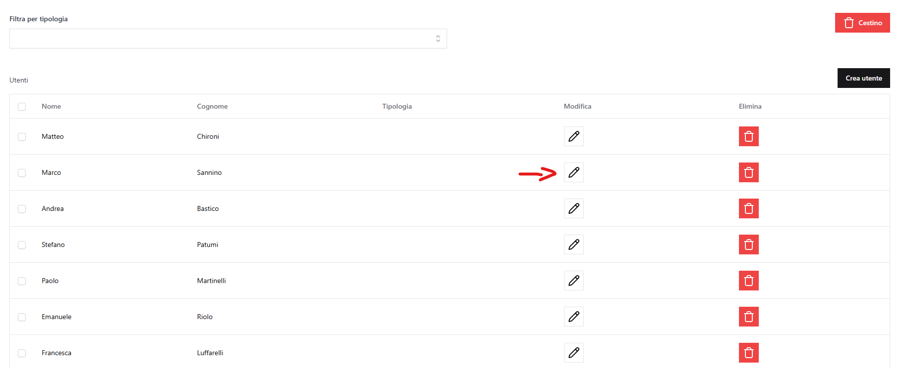

I campi sono gestiti nello stesso modo della creazione.

---

## c) Eliminazione utente

Per eliminare un utente:

- Cliccare sull'icona **cestino** accanto al nome dell'utente.

    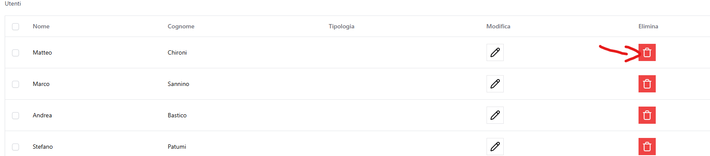

- Confermare l'operazione nel popup.

    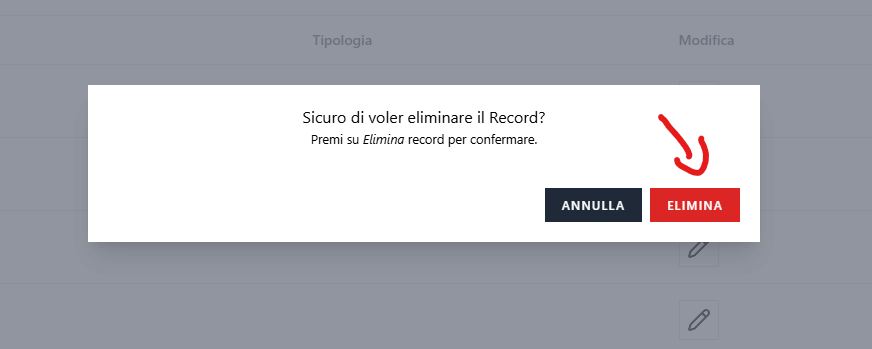

### Eliminazione multipla

- Selezionare uno o più utenti tramite checkbox.
- Cliccare sul pulsante **Delete**, che mostra il numero di utenti selezionati.

    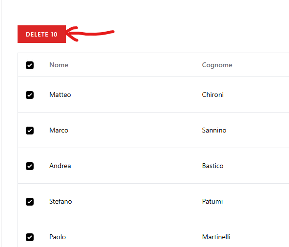

- Confermare l'eliminazione.

    

Alla prima eliminazione, l'utente viene spostato nel **Cestino**, da cui può essere:

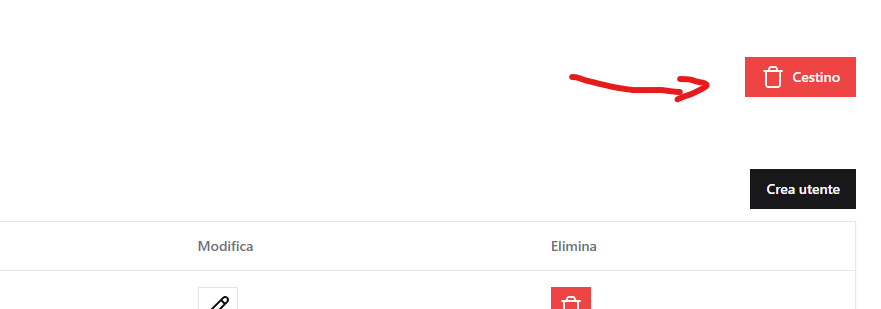

- Ripristinato

    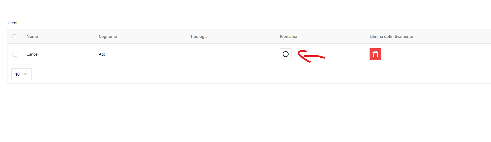

- Eliminato definitivamente

    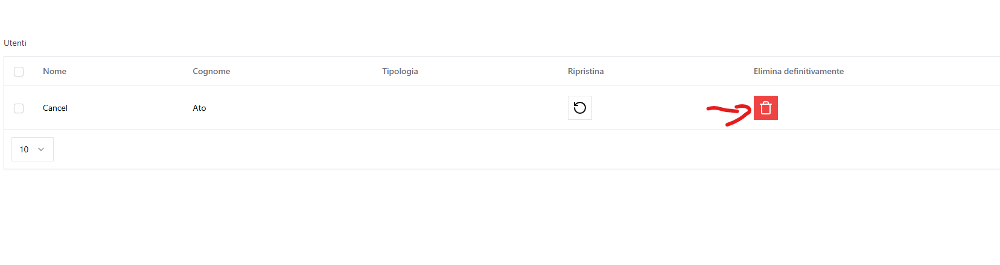

Il cestino è accessibile tramite il pulsante **"Cestino"** in alto a destra nella lista utenti.

---

[← Torna all'indice](README.md)
