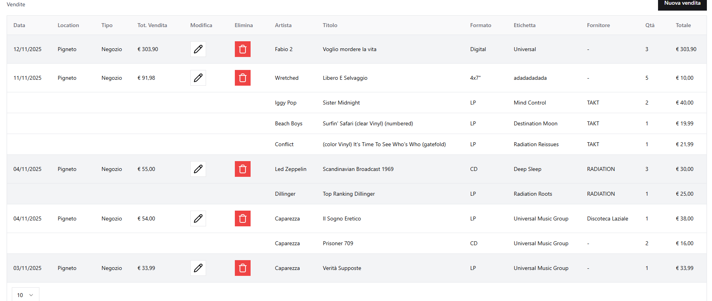
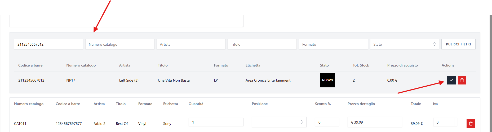
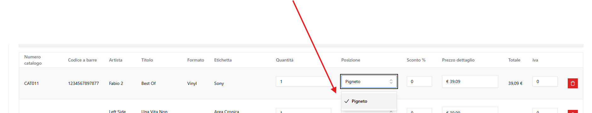
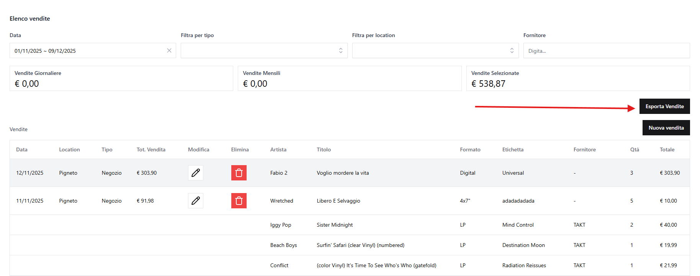
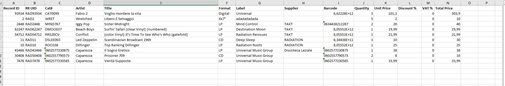

# Vendite

Dal menu laterale, selezionando **Vendite (`/sale`)**, si accede alla pagina di gestione delle vendite, da cui è possibile **creare, modificare, cercare, filtrare, esportare ed eliminare le vendite**.

Nella lista delle vendite, ogni vendita mostra anche i record associati.
Per facilitare la lettura, le vendite sono visivamente separate tramite un'alternanza di colori (bianco e grigio), così da distinguere più facilmente i record appartenenti alla stessa vendita.

---

## a) Creare una vendita

Per creare una vendita:

1. Cliccare su **Crea Vendita**.
2. Compilare i dati richiesti.

**Campi obbligatori:**

- Location: viene preselezionata automaticamente la location predefinita impostata per l'utente che sta inserendo la vendita - nel caso in cui questa sia di tipo "store".
- Tipo
- Data

### Da sapere sulla creazione delle vendite

- Per inserire i record all'interno di una vendita è disponibile un **filtro di ricerca** che, durante la digitazione, mostra i record corrispondenti.  
  I record possono essere aggiunti:

    - cliccando sul pulsante **`✓`** a destra del risultato, oppure
    - se il risultato è **un solo record**, premendo **Invio** mentre il cursore è attivo su uno dei campi di filtro, senza necessità di cliccare alcun pulsante.

        

- Una volta inserito il record nella vendita, è possibile selezionare la **posizione** (area della location). Questa operazione scalerà automaticamente lo **stock** del record. È inoltre possibile inserire un **eventuale sconto** e modificare il **prezzo di vendita**, qualora non corrisponda a quello salvato nel record.

    

---

## b) Modifica vendita

- Cliccare sull'icona **matita** accanto alla voce "Tot. vendita" della vendita da dover modificare
- I campi sono gestiti come nella creazione.

---

## c) Eliminazione Vendita

Il funzionamento è analogo a quello degli utenti e delle altre sezioni:

- Eliminazione singola o multipla
- Le vendite non hanno cestino quindi non hanno possibilità di ripristino o eliminazione definitiva

---

## d) Esportazione vendite

Nella lista delle vendite, in alto a destra, è presente il pulsante **"Esporta Vendite"**. Cliccandolo, viene generato un **file Excel** contenente i record venduti visualizzati nella lista, in base ai **filtri selezionati**.

---

## e) Impatto su Discogs

Le vendite possono influenzare automaticamente gli annunci pubblicati su Discogs:

**Quando si vende un record pubblicato su Discogs:**

- **Stock esaurito**: Se la vendita porta lo stock del record a zero, l'annuncio viene **automaticamente rimosso** da Discogs
- **Stock residuo in altre aree**: Se dopo la vendita rimane stock in altre aree (location Warehouse), l'annuncio viene **automaticamente aggiornato** con la nuova location, seguendo l'ordine delle aree

**Esempio:**
Record pubblicato su Discogs con stock in 2 aree:

- Area Magazzino: 3 pezzi (pubblicata su Discogs)
- Area Deposito: 5 pezzi

Dopo una vendita di 3 pezzi dall'Area Magazzino:

- Stock Area Magazzino: 0
- L'annuncio su Discogs viene aggiornato automaticamente con "Area Deposito"

**Nota**: Le vendite generate automaticamente dagli ordini Discogs seguono lo stesso processo. Per maggiori informazioni sulla sincronizzazione ordini, vedere [Discogs - Sincronizzazione Ordini](DISCOGS.md).

---

[← Torna all'indice](README.md)
